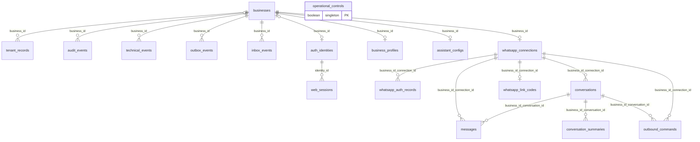

# La base de datos de AgendIA

AgendIA guarda negocios, accesos, configuración del asistente y conversaciones de WhatsApp en PostgreSQL. Esta guía explica las **18 tablas de la aplicación** para quienes no trabajan habitualmente con bases de datos. Describe los archivos del repositorio: no confirma qué migraciones se aplicaron en un servidor ni inspecciona datos reales.

## Cómo leer esta guía

- Para entender el conjunto: leer el modelo y el diagrama.
- Para buscar un dato: consultar el diccionario por nombre de tabla.
- Para entender protección y borrado: leer aislamiento, restricciones y datos sensibles.
- Para comprobar un detalle técnico: seguir los enlaces a las fuentes al final.

Las migraciones SQL, leídas de forma acumulativa, son la referencia del modelo completo. [El esquema de Drizzle](../packages/db/src/schema.ts) solo declara `businesses` y `tenant_records`: no es un inventario completo.

## Modelo en pocas palabras

Un **negocio** es la unidad de separación de datos. Su identificador, `business_id`, acompaña a la mayoría de los registros. Dos negocios pueden usar la misma aplicación sin compartir conversaciones ni configuración.

| Área | Qué guarda | Tablas |
| --- | --- | --- |
| Negocios | Identidad y una relación mínima de prueba de aislamiento | `businesses`, `tenant_records` |
| Acceso web | Usuarios y sesiones | `auth_identities`, `web_sessions` |
| Configuración | Información del negocio y reglas del asistente | `business_profiles`, `assistant_configs` |
| WhatsApp | Conexión, credenciales cifradas y código temporal de vinculación | `whatsapp_connections`, `whatsapp_auth_records`, `whatsapp_link_codes` |
| Conversaciones | Historial, resúmenes y órdenes de respuesta | `conversations`, `messages`, `conversation_summaries`, `outbound_commands` |
| Seguimiento y trabajo | Auditoría, diagnóstico y eventos pendientes o recibidos | `audit_events`, `technical_events`, `outbox_events`, `inbox_events` |
| Operación global | Interruptor de automatización | `operational_controls` |

**No hay tablas de turnos, citas ni reservas en este modelo.** La información de servicios y horarios se guarda como texto en el perfil; no constituye una agenda estructurada.

## Glosario mínimo

| Término | Explicación |
| --- | --- |
| Tabla / fila / columna | Una colección de registros / un registro / uno de sus campos. |
| PK, clave primaria | Identificador único de una fila. Puede combinar varias columnas. |
| FK, clave foránea | Regla que obliga a que el registro relacionado exista. |
| `UNIQUE` | Impide repetir un valor o una combinación de valores. |
| `CHECK` | Condición que PostgreSQL comprueba al escribir. |
| `NULL` | Ausencia de valor; no equivale a texto vacío ni a cero. |
| Valor predeterminado | Valor usado si una inserción omite la columna; no implica actualización automática posterior. |
| `uuid` | Identificador de formato estándar, no un número correlativo. |
| `timestamptz` | Fecha y hora que PostgreSQL maneja con referencia de zona horaria. |
| `jsonb` | Datos estructurados con claves y valores, como un objeto JSON. |
| `bytea` | Bytes; se usa aquí para material cifrado. |
| Tenant | Negocio cuyos datos deben quedar aislados de otros negocios. |
| RLS | Seguridad por fila: limita qué registros puede leer o cambiar un rol. |
| Rol | Conjunto de permisos de base de datos; no es lo mismo que un usuario de la aplicación. |
| Hash | Huella de un valor; no se descifra para recuperar el original. |
| Cifrado | Protección reversible con la clave adecuada. |
| Outbox / inbox | Registro de trabajo por publicar / registro de eventos recibidos para evitar duplicados. |
| Idempotencia | Procesar de nuevo una petición sin duplicar su efecto previsto. |

## Relaciones reales

El diagrama incluye **solo claves foráneas declaradas en SQL**. Una línea no significa que el borrado sea automático. `o|` indica cero o uno, `||` exactamente uno y `o{` cero o muchos.

### Si el visor no muestra el diagrama

- Un negocio puede tener muchos registros de prueba, eventos y conversaciones a través de su conexión.
- Tiene como máximo un perfil, una configuración del asistente, una conexión y una identidad `business_user`. No está obligado a tenerlos.
- Una identidad puede tener muchas sesiones web. Los administradores de plataforma no pertenecen a un negocio.
- Una conexión puede tener muchos registros de autenticación, conversaciones, mensajes y órdenes de salida; como máximo un código de vinculación.
- Una conversación puede tener muchos mensajes, versiones de resumen y órdenes de salida.
- La auditoría puede pertenecer a un negocio o al ámbito de plataforma (`business_id` vacío).
- `operational_controls` es independiente: no tiene FK.

Las relaciones compuestas incluyen `business_id`: por ejemplo, un mensaje no puede apuntar por FK a una conversación de otro negocio. Las FK separadas hacia conversación y conexión no comprueban por sí solas que ambas usen la misma conexión, pero **el modelo actual sí lo garantiza**: `whatsapp_connections.business_id` es único, por lo que cada negocio solo puede tener una conexión. Si en el futuro se admiten varias, habrá que revisar esa garantía.

`outbound_commands.source_message_id` es una referencia lógica con índice único, **no una FK**. Por eso no aparece como relación con `messages`.

## Diccionario de las 18 tablas

Convenciones: se indican todos los campos, agrupados por función. Salvo cuando se dice «opcional», las columnas son obligatorias (`NOT NULL` o PK). Las PK llamadas `id` usan `uuid` y `gen_random_uuid()` por defecto, excepto `businesses.id`, que debe proporcionarse. Los campos `created_at`, `updated_at` y `occurred_at` usan `timestamptz` y `now()` por defecto cuando existen.

### 1. `businesses`: el negocio

| Campos | Significado y reglas |
| --- | --- |
| `id` | PK UUID sin valor predeterminado. |
| `name` | Nombre, `varchar(160)`; no puede quedar vacío después de quitar espacios. |
| `status` | `active` o `suspended`; predeterminado `active`. |
| `created_at` | Fecha de creación. |
| `last_technical_activity_at` | Fecha opcional de última actividad técnica; la actualiza un disparador al insertar eventos técnicos. |

Suspender un negocio cambia un estado: no elimina sus datos.

### 2. `tenant_records`: relación mínima de aislamiento

| Campos | Significado y reglas |
| --- | --- |
| `id`, `business_id` | PK del registro y FK obligatoria al negocio. También son únicos como pareja `(business_id, id)`. |
| `value` | Texto obligatorio. |

Es una tabla mínima para demostrar la política de separación, no una tabla de reservas.

### 3. `auth_identities`: acceso de usuarios

| Campos | Significado y reglas |
| --- | --- |
| `id`, `normalized_email` | PK y correo obligatorio único. La normalización la realiza la aplicación. |
| `password_phc` | Hash de contraseña en formato PHC, no contraseña legible. |
| `role`, `business_id` | `platform_admin` exige `business_id` NULL; `business_user` exige FK a un negocio. |
| `active`, `created_at` | Habilitación, predeterminada `true`, y fecha de creación. |

Un índice único parcial permite como máximo un `business_user` por negocio, incluso si está inactivo. No impone un único administrador de plataforma.

### 4. `web_sessions`: sesiones de acceso web

| Campos | Significado y reglas |
| --- | --- |
| `id`, `identity_id` | PK y FK a la identidad. |
| `token_sha256`, `csrf_sha256` | Huellas `char(64)` del token de sesión y de protección CSRF; `token_sha256` es único. |
| `created_at`, `last_seen_at` | Creación y última actividad; ambos empiezan con `now()`. |
| `absolute_expires_at`, `idle_expires_at` | Vencimiento total y por inactividad; obligatorios, sin valor predeterminado. |
| `revoked_at` | Fecha opcional de revocación. |

La aplicación evalúa vencimientos y revocación. Una fecha vencida no borra automáticamente la fila.

### 5. `business_profiles`: información pública del negocio

| Campos | Significado y reglas |
| --- | --- |
| `business_id`, `display_name` | PK y FK al negocio; nombre visible `varchar(160)`. |
| `description` | Descripción, hasta 4000 caracteres. |
| `address`, `contact` | Dirección y contacto, hasta 500 caracteres cada uno. |
| `business_hours` | Horarios en texto, hasta 2000 caracteres. |
| `offerings`, `faq`, `policies`, `additional_info` | Servicios, preguntas frecuentes, políticas e información adicional; hasta 8000 caracteres cada campo. |
| `updated_at` | Fecha con valor inicial `now()`. |

Todos los textos salvo `display_name` empiezan como `''`. No existen columnas estructuradas de disponibilidad.

### 6. `assistant_configs`: comportamiento del asistente

| Campos | Significado y reglas |
| --- | --- |
| `business_id` | PK y FK: como máximo una configuración por negocio. |
| `personality`, `tone`, `instructions` | Personalidad, tono e instrucciones. |
| `knowledge`, `rules`, `restrictions` | Conocimiento, reglas y restricciones. |
| `active` | Predeterminado `false`: la fila puede existir sin activar el asistente. |
| `revision`, `updated_at` | Revisión entera, predeterminada 0 y no negativa; fecha de actualización. |

Los seis campos de texto permiten hasta 8000 caracteres cada uno y empiezan vacíos.

### 7. `whatsapp_connections`: estado de conexión

| Campos | Significado y reglas |
| --- | --- |
| `id`, `business_id` | PK y FK; `business_id` único. También hay unicidad `(business_id, id)`. |
| `session_public_id` | UUID público único, generado por defecto; no es la clave de cifrado. |
| `state` | Predeterminado `LINK_REQUIRED`; estados permitidos debajo. |
| `linked_number` | Número vinculado opcional, hasta 40 caracteres. |
| `linked_at`, `last_connected_at` | Fechas opcionales de vinculación y última conexión. |
| `owner_id`, `heartbeat_at` | Responsable técnico y señal de actividad, opcionales. |
| `version` | Entero no negativo, predeterminado 0. |
| `wrapped_dek`, `wrapped_dek_nonce`, `wrapped_dek_tag`, `kek_version` | Clave de datos protegida, nonce, etiqueta y versión de clave protectora; todos opcionales. |

Estados: `LINK_REQUIRED`, `LINKING`, `CONNECTED`, `RECONNECTING`, `DISCONNECTED`, `ERROR`.

### 8. `whatsapp_auth_records`: credenciales técnicas cifradas

| Campos | Significado y reglas |
| --- | --- |
| `business_id`, `connection_id`, `record_name` | PK compuesta; FK `(business_id, connection_id)` hacia la conexión. |
| `version` | Entero estrictamente positivo. |
| `nonce`, `ciphertext`, `auth_tag` | Bytes usados para descifrar y autenticar el registro. |

Solo el rol del gestor de WhatsApp tiene permisos directos sobre esta tabla. No es un historial de mensajes.

### 9. `whatsapp_link_codes`: vinculación temporal

| Campos | Significado y reglas |
| --- | --- |
| `connection_id`, `business_id` | PK por conexión y FK compuesta hacia ella. |
| `token` | UUID obligatorio único, sin valor predeterminado. |
| `ciphertext`, `nonce`, `auth_tag` | Código cifrado; nonce de 12 bytes y etiqueta de 16 bytes, comprobados por SQL. |
| `expires_at`, `created_at` | Vencimiento obligatorio y creación. |

Tiene índice de vencimiento. Al borrar su conexión se borra por `ON DELETE CASCADE`; el vencimiento por sí solo no la borra.

### 10. `conversations`: una conversación por interlocutor y conexión

| Campos | Significado y reglas |
| --- | --- |
| `id`, `business_id`, `connection_id` | PK y pertenencia; FK compuesta hacia la conexión. |
| `remote_jid` | Identificador del interlocutor en WhatsApp. |
| `next_sequence` | Próximo número de orden, `bigint`, predeterminado 1; no tiene `CHECK` de positividad. |
| `created_at` | Creación. |

Son únicos `(business_id, connection_id, remote_jid)` y `(business_id, id)`.

### 11. `messages`: historial de mensajes

| Campos | Significado y reglas |
| --- | --- |
| `id`, `business_id`, `conversation_id`, `connection_id` | PK y FK compuestas hacia conversación y conexión. |
| `provider_message_id` | Identificador del proveedor; único junto con negocio y conexión. |
| `sequence` | Orden `bigint`, único junto con negocio y conversación. |
| `direction` | Solo `inbound` (entrante) u `outbound` (saliente). |
| `raw_text` | Texto original obligatorio; no se cifra en estas migraciones. |
| `received_at` | Fecha obligatoria, sin valor predeterminado. |
| `processing_state` | `varchar(24)`, predeterminado `pending`; SQL no enumera sus valores permitidos. |

También es único `(business_id, id)`. Hay índices de orden y de búsqueda de texto; no sustituyen los filtros por negocio y conversación.

### 12. `conversation_summaries`: versiones de contexto resumido

| Campos | Significado y reglas |
| --- | --- |
| `id`, `business_id`, `conversation_id` | PK y FK compuesta hacia conversación. |
| `version` | Entero positivo; único junto con negocio y conversación. |
| `covered_through` | Secuencia cubierta, `bigint` no negativo. |
| `structured_summary`, `created_at` | Resumen JSON obligatorio y creación. |

Es único `(business_id, id)`. Los trabajadores tienen lectura e inserción, no actualización ni borrado directo. No hay aquí un disparador de inmutabilidad como el de auditoría; el historial original sigue siendo la referencia.

### 13. `outbound_commands`: órdenes de envío

| Campos | Significado y reglas |
| --- | --- |
| `outbound_id` | PK UUID generado; también único junto con `business_id`. |
| `business_id`, `conversation_id`, `connection_id` | FK compuestas hacia conversación y conexión. |
| `text` | Texto obligatorio de longitud mayor que cero; espacios solos no están prohibidos por este `CHECK`. |
| `state` | Predeterminado `pending`; estados permitidos debajo. |
| `claimed_by`, `claimed_at`, `send_started_at` | Responsable, toma del trabajo e inicio del envío; opcionales. |
| `provider_message_id`, `acknowledged_at`, `failure_code` | Identificador del envío, confirmación y código de fallo; opcionales. |
| `created_at`, `updated_at` | Fechas con valor inicial `now()`. |
| `source_message_id` | UUID opcional, único cuando existe, sin FK. |

Estados: `pending`, `processing`, `generated`, `sending`, `sent`, `failed`, `delivery_unknown`. Hay un índice para reclamar órdenes `generated` y unicidad parcial del identificador del proveedor por negocio y conexión.

`delivery_unknown` expresa incertidumbre: no equivale necesariamente a un envío fallido ni autoriza por sí solo a reenviar.

### 14. `audit_events`: registro de acciones

| Campos | Significado y reglas |
| --- | --- |
| `id`, `business_id`, `actor_id` | PK; negocio con FK opcional; actor opcional. |
| `event_type`, `outcome`, `request_id` | Tipo, resultado (`success`, `failure`, `denied`) e identificador de solicitud. |
| `metadata`, `occurred_at` | JSON, predeterminado `{}`, y fecha del evento. |
| `stream_sequence` | Secuencia positiva; única por negocio o por ámbito `platform` si no hay negocio. |
| `previous_hash` | Hasta 64 caracteres: hexadecimal minúsculo de 64 caracteres o `GENESIS`. |
| `event_hash` | Huella hexadecimal minúscula de 64 caracteres. |
| `hmac_key_version` | Texto obligatorio no vacío que identifica la versión usada. |
| `source` | Origen obligatorio, predeterminado `runtime`. |

Es único `(business_id, id)`. Un disparador rechaza `UPDATE` y `DELETE`. Las restricciones de formato **no prueban** que los hashes sean correctos ni que nadie con privilegios elevados haya alterado la base.

La función `append_runtime_audit` limita eventos, origen, rol y contexto; encadena eventos bajo bloqueo por ámbito. Calcula SHA-256 y guarda `runtime-v1`: el nombre `hmac_key_version` no significa que esa función calcule un HMAC.

### 15. `technical_events`: diagnóstico técnico

| Campos | Significado y reglas |
| --- | --- |
| `id`, `business_id` | PK y FK obligatoria al negocio; pareja única. |
| `component`, `code` | Componente y código del evento. |
| `severity` | `info`, `warning`, `error` o `critical`. |
| `safe_details`, `occurred_at` | JSON predeterminado `{}` y fecha. |

Cada inserción proyecta la fecha máxima de actividad técnica en `businesses`. El nombre `safe_details` no elimina secretos automáticamente: quien escribe debe evitar incluirlos.

### 16. `outbox_events`: trabajo pendiente de publicación

| Campos | Significado y reglas |
| --- | --- |
| `id`, `business_id` | PK y FK al negocio; pareja única. |
| `topic`, `stable_key`, `payload` | Tema, clave estable y contenido JSON obligatorio. |
| `created_at`, `published_at` | Creación y publicación opcional. |
| `claim_token`, `claimed_at` | UUID y fecha opcionales para reclamar temporalmente trabajo. |
| `publish_attempts` | Entero predeterminado 0; sin `CHECK` de no negatividad. |
| `next_attempt_at` | Próximo intento, predeterminado `now()`. |

`(business_id, stable_key)` es único. Las funciones de despacho de `ai.generate` reclaman, completan o liberan trabajo usando un token, y permiten recuperar reclamos antiguos.

### 17. `inbox_events`: deduplicación de entradas

| Campos | Significado y reglas |
| --- | --- |
| `id`, `business_id` | PK y FK al negocio; pareja única. |
| `source`, `stable_key` | Origen y clave estable; únicos junto con negocio. |
| `received_at` | Fecha predeterminada `now()`. |

No guarda el cuerpo de un mensaje: registra su identidad para detectar repeticiones.

### 18. `operational_controls`: control global

| Campos | Significado y reglas |
| --- | --- |
| `singleton` | PK booleana, predeterminada `true`; un `CHECK` exige que sea verdadera. Permite como máximo una fila. |
| `automation_disabled` | Interruptor global, predeterminado `false`. |
| `incident_reference` | Texto opcional de referencia del incidente. |
| `updated_at` | Fecha con valor inicial `now()`. |

La migración crea la fila inicial. El `CHECK` intenta exigir referencia no vacía al desactivar automatización, pero **acepta NULL** por la semántica de SQL; no garantiza por sí solo que exista una referencia. Los roles de trabajador y WhatsApp solo leen este control; su cambio corresponde al plano de operación con el propietario DDL.

## Restricciones y borrado: qué garantiza la base

- Las PK y las reglas `UNIQUE` evitan duplicados y crean sus índices de respaldo. Una FK **no crea automáticamente un índice** en las columnas que la contienen.
- Las claves estables de inbox y outbox, los identificadores del proveedor y las secuencias ayudan a evitar duplicaciones; no prometen entrega «exactamente una vez» en un sistema externo.
- Salvo `whatsapp_link_codes`, las FK usan el comportamiento predeterminado **`NO ACTION`**: borrar un padre con dependientes normalmente falla. No se borran en cadena las conversaciones, mensajes o credenciales.
- El único `ON DELETE CASCADE` declarado elimina códigos de vinculación al eliminar su conexión. Otros dependientes pueden impedir que esa conexión se elimine.
- La auditoría rechaza cambios y borrados por disparador, además de los permisos concedidos.
- Suspender un negocio, revocar una sesión o vencer un código no es borrarlo. Estas migraciones no definen una limpieza automática general ni plazos de retención del historial.
- `updated_at DEFAULT now()` solo asigna el valor inicial: no hay una regla general que actualice automáticamente todas esas fechas.

## Aislamiento por negocio y roles

La aplicación establece contexto de transacción, incluido `app.tenant_id`. Las políticas comparan ese identificador con `business_id`. En `tenant_records` también se exige `app.actor_role = 'business_user'`; **no todas las políticas comprueban esa etiqueta de actor**.

Tienen RLS habilitada y forzada las 14 tablas de contenido por negocio: todas excepto `businesses`, `auth_identities`, `web_sessions` y `operational_controls`. La auditoría admite un negocio NULL, pero las políticas habituales de igualdad con tenant no dan acceso directo a esas filas de plataforma.

| Rol PostgreSQL | Finalidad y límites principales |
| --- | --- |
| `agendia_runtime` | Acceso web del negocio, perfil/configuración, sesiones y lectura de conexión/código; no acceso directo a historial de conversaciones ni credenciales de WhatsApp. |
| `agendia_admin_runtime` | Administración de negocios e identidades; vista `admin_business_status`, auditoría por contexto e inserción de outbox. No permiso general sobre conversaciones ni material de autenticación de WhatsApp. |
| `agendia_whatsapp_runtime` | Gestionar conexión, credenciales, códigos, entrada de mensajes y entrega de órdenes; contexto por negocio y funciones concretas para reclamar trabajo. |
| `agendia_worker_runtime` | Leer configuración y contexto, generar mensajes/órdenes, insertar resúmenes y eventos; sin acceso directo a credenciales de WhatsApp. Usa el esquema `pgboss` para trabajos. |

Los cuatro roles se crean como `NOLOGIN`, sin privilegios de superusuario ni `BYPASSRLS`, y no son propietarios de las tablas de tenant. Los permisos reales se acumulan con `GRANT` y `REVOKE`: una política RLS no concede por sí sola permiso de tabla.

RLS forzada no significa protección absoluta frente a superusuarios. Tampoco protege por filas las cuatro tablas sin RLS: allí importan los permisos y las consultas de la aplicación.

Las funciones `SECURITY DEFINER` ejecutan operaciones con los privilegios de su propietario; ofrecen accesos acotados para enrutar sesiones, restaurar conexiones, reclamar trabajo o registrar auditoría. Para esas funciones de runtime, la ejecución se revoca a `PUBLIC` y se concede a roles específicos. La función de disparador `project_last_technical_activity` también es `SECURITY DEFINER`, pero las migraciones no revocan explícitamente su ejecución a `PUBLIC`; no es una función invocable directamente como las anteriores. Estas funciones son parte del límite de seguridad, no una prueba de que todas las operaciones pasen por RLS ordinaria.

`admin_business_status` es una **vista**, no una tabla adicional: proyecta identidad y estado del negocio, estado del asistente y de WhatsApp, sin exponer el contenido de los mensajes.

## Recorrido simplificado de un mensaje

1. El negocio configura `business_profiles` y `assistant_configs`; vincula una `whatsapp_connections` con ayuda de `whatsapp_link_codes` y credenciales cifradas.
2. El gestor identifica la sesión y su negocio. `route_whatsapp_session` solo devuelve conexiones `CONNECTED`, junto con estado del negocio y activación del asistente.
3. El mensaje recibido se asocia a `conversations` y se guarda en `messages`. Las claves únicas e `inbox_events` ayudan a reconocer repeticiones.
4. `outbox_events` conserva trabajo durable, como `ai.generate`. Las funciones de reclamo evitan que dos procesos tomen simultáneamente la misma fila mediante bloqueos y `SKIP LOCKED`.
5. El trabajador consulta perfil, configuración, mensajes y resúmenes; produce una orden en `outbound_commands`. Los resúmenes agregan versiones sin reemplazar el texto original.
6. El gestor reclama una orden `generated` de una conexión conectada que le pertenece; obtiene también `remote_jid`, pasa a `sending` y gestiona la confirmación o incertidumbre.
7. `audit_events` registra acciones y `technical_events` aporta diagnóstico. `operational_controls` permite consultar el interruptor global.

Este recorrido explica la función de los datos; SQL no implementa por sí solo toda la generación de respuestas, validación de negocio ni comunicación con WhatsApp.

La cola pg-boss dispone del esquema `pgboss`; sus tablas internas las define la biblioteca en ejecución, no estas migraciones. Por eso no forman parte de las 18 tablas del diccionario.

## Datos sensibles y protección

| Datos | Tratamiento observado en las fuentes |
| --- | --- |
| Contraseña (`password_phc`) | Hash Argon2id en la aplicación; no cifrado reversible. |
| Tokens web (`token_sha256`, `csrf_sha256`) | Huellas SHA-256 almacenadas, no tokens originales cifrados. |
| Credenciales de WhatsApp | AES-256-GCM en la aplicación; `ciphertext`, nonce y etiqueta permiten descifrado autenticado con la clave correcta. |
| Clave de datos de conexión | DEK protegida por una KEK; SQL guarda `wrapped_dek` y su versión, no describe un servicio de claves desplegado. |
| Código temporal de vinculación | AES-256-GCM con contexto de negocio, conexión y token; vencimiento registrado en SQL. |
| Mensajes y resúmenes | `raw_text` y `structured_summary` no tienen cifrado de aplicación declarado aquí. |
| Perfil, correo, número, interlocutor y eventos | Pueden contener datos personales; no debe suponerse que están cifrados por tener RLS. |

No copiar credenciales, códigos de vinculación, tokens ni textos de clientes a diagnósticos o capturas de soporte. Los nombres `metadata`, `safe_details` y `payload` no garantizan que su contenido sea seguro.

El cifrado de disco, transporte, copias de seguridad, conservación de claves y permisos efectivos del servidor son decisiones de despliegue. Esta guía no verifica esas protecciones ni una instalación en producción.

## Fuentes para verificar o profundizar

Todos los enlaces apuntan a código del repositorio, no a una base activa.

- [0000: negocios, tabla mínima y roles](../packages/db/migrations/0000_base.sql).
- [0001: eventos e inmutabilidad de auditoría](../packages/db/migrations/0001_events.sql), [0002: identidades y sesiones](../packages/db/migrations/0002_auth.sql), [0003: administración inicial](../packages/db/migrations/0003_administration.sql).
- [0004: perfil](../packages/db/migrations/0004_business_profile.sql), [0005: asistente](../packages/db/migrations/0005_assistant_config.sql).
- [0006: conexión](../packages/db/migrations/0006_whatsapp_connection.sql), [0007: credenciales cifradas](../packages/db/migrations/0007_whatsapp_auth.sql).
- [0008: conversaciones y mensajes](../packages/db/migrations/0008_messages.sql), [0009: resúmenes y búsqueda](../packages/db/migrations/0009_conversation_context.sql), [0010: órdenes de salida](../packages/db/migrations/0010_outbound_delivery.sql).
- [0011: cadena de auditoría, proyección técnica y control global](../packages/db/migrations/0011_observability_security.sql).
- [0012: permisos y esquema de cola](../packages/db/migrations/0012_runtime_repositories_grants.sql), [0013: vista y permisos administrativos posteriores](../packages/db/migrations/0013_http_composition.sql).
- [0014: reclamo de vinculación y restauración](../packages/db/migrations/0014_baileys_manager.sql), [0015: permisos de trabajadores, mensaje de origen y funciones de envío](../packages/db/migrations/0015_message_workers.sql).
- [0017: destino del envío](../packages/db/migrations/0017_outbound_remote_jid.sql), [0017: códigos temporales](../packages/db/migrations/0017_whatsapp_link_codes.sql). Son dos archivos distintos con el mismo prefijo.
- [0018: reclamos y reintentos de outbox](../packages/db/migrations/0018_outbox_dispatch.sql), [0019: inserción de resúmenes](../packages/db/migrations/0019_conversation_summary_jobs.sql), [0020: auditoría de runtime](../packages/db/migrations/0020_audit_runtime_events.sql).
- [Autenticación y hashes](../packages/auth/src/index.ts), [cifrado de credenciales de WhatsApp](../packages/whatsapp-baileys/src/auth-store.ts), [repositorios y cifrado de códigos](../packages/db/src/repositories.ts).

Para operaciones, permisos de despliegue y copias de seguridad, consultar [la guía de despliegue](DEPLOYMENT.md).

Para conocer el estado de una instalación concreta hace falta una verificación operativa autorizada: este documento no la sustituye.
